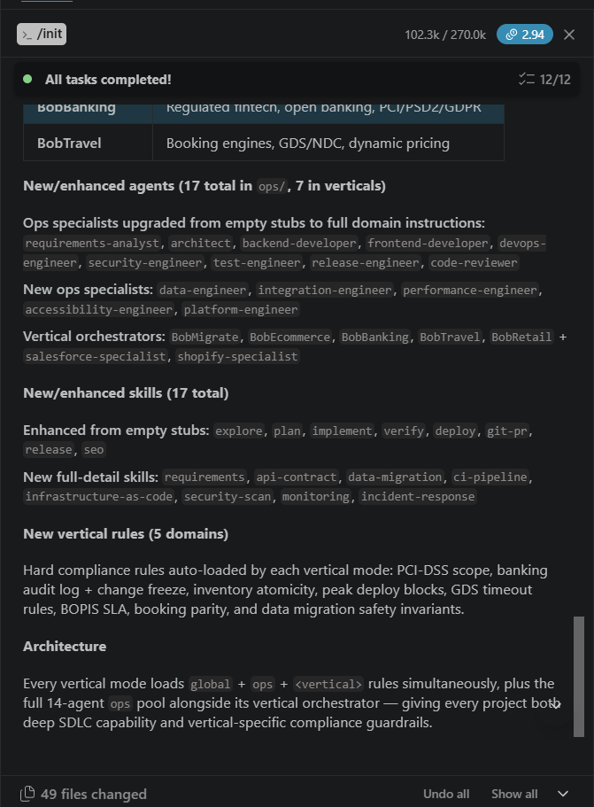
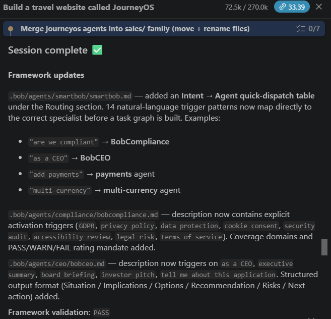
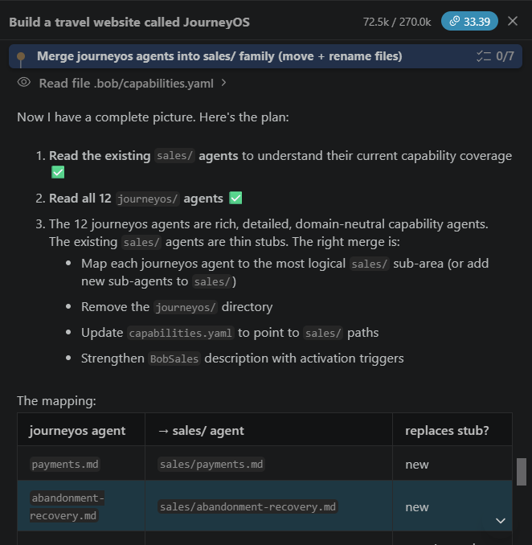
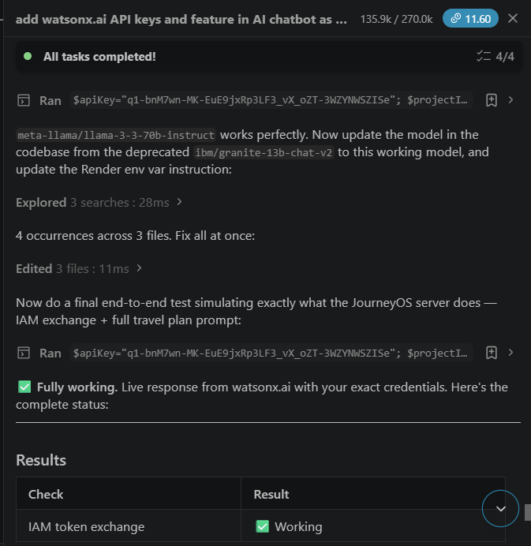
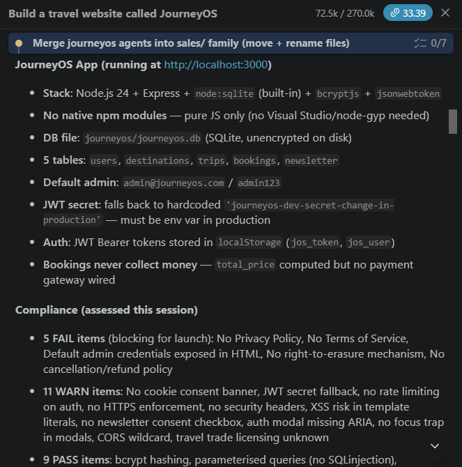
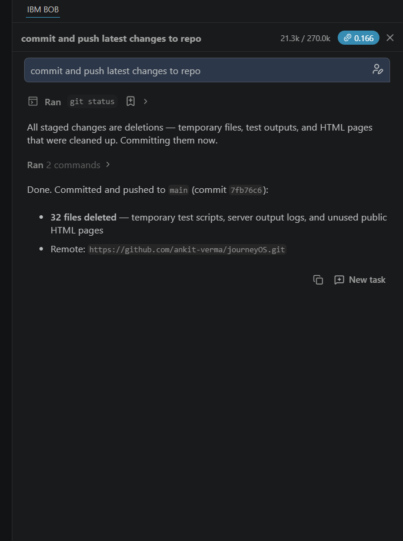

# IBM Bob Task Session Summary — Screenshots
## JourneyOS · IBM TechXchange 2026 Pre-conference Dev Day Hackathon

This directory contains IBM Bob task session summary screenshots captured during the development of JourneyOS.

---

## 📸 Screenshots Included

| File | Session | What It Shows |
|------|---------|---------------|
| [bob-session-S00-smartbob-framework-init-49-files.png](#s00) | **S-00** SmartBob `/init` | 12/12 tasks completed · 49 files changed · Full framework initialisation including ops specialists, vertical orchestrators, new skills (requirements, api-contract, ci-pipeline, security-scan, monitoring) and vertical rules (PCI-DSS, GDS, BOPIS) |
| [bob-session-S01-journeyos-build-session-complete.png](#s01) | **S-01** JourneyOS Build | Session complete ✅ · Framework updates: `.bob/agents/smartbob/smartbob.md` intent→agent dispatch table (14 patterns), BobCompliance activation triggers added, BobCEO structured output format · **Framework validation: PASS** |
| [bob-session-S02-smartbob-agent-orchestration-planning.png](#s02) | **S-02** Agent Orchestration | SmartBob planning phase: reads 12 journeyos agents, maps each to `sales/` family, builds task graph showing agent→file mapping table, dependency ordering |
| [bob-session-S05-watsonx-ai-iam-verified-llama3-model.png](#s05) | **S-05** watsonx.ai Integration | **✅ Fully working** · IAM token exchange: Working · Live response from watsonx.ai · model updated from deprecated `ibm/granite-13b-chat-v2` to `meta-llama/llama-3-3-70b-instruct` · 4/4 tasks · end-to-end test: IAM exchange + full travel plan prompt confirmed working |
| [bob-session-S08-compliance-security-audit.png](#s08) | **S-08** Security & Compliance | Stack: Node.js 24 + Express + node:sqlite + bcryptjs + jsonwebtoken · **5 FAIL** (no Privacy Policy, no ToS, admin credentials, no right-to-erasure, no cancellation policy) · **11 WARN** (JWT fallback, CORS wildcard, XSS risk, no rate limiting) · **9 PASS** (bcrypt, parameterised queries, JWT auth, no SQLi) |
| [bob-session-S09-git-cleanup-commit-push.png](#s09) | **S-09** Git Cleanup & Push | Bob ran `git status`, staged all 32 deletions (temp test scripts, server output logs, unused public HTML pages), committed as `7fb76c6` and pushed to `main` on `github.com/ankit-verma/journeyOS` · 21.3k / 270k tokens · cost: $0.166 |

---

## Screenshot Details

### S-00 — SmartBob Framework Init (49 files changed) {#s00}

**Key evidence:** SmartBob ran `/init` and completed 12/12 tasks. Shows the full scope of the framework being built — new ops specialists (`data-engineer`, `integration-engineer`, `performance-engineer`), vertical orchestrators (`BobMigrate`, `BobEcommerce`, `BobBanking`, `BobTravel`, `BobRetail`), 17 new/enhanced skills, and 5 domain vertical rules auto-loaded by each mode.

---

### S-01 — JourneyOS Build Session Complete {#s01}

**Key evidence:** Session complete ✅ with framework validation PASS. SmartBob updated the intent→agent dispatch table with 14 natural-language trigger patterns (e.g. `"are we compliant"` → BobCompliance, `"as a CEO"` → BobCEO). Shows the multi-agent routing system working in practice on the JourneyOS project.

---

### S-02 — SmartBob Agent Orchestration Planning {#s02}

**Key evidence:** SmartBob in planning mode — discovers the full picture by reading capabilities, reads all 12 existing agents, produces a dependency-mapped task graph, and outputs an agent→file mapping table. Demonstrates SmartBob's "discover before prescribing" principle and parallel workstream planning.

---

### S-05 — watsonx.ai IAM Verified · Llama 3-3-70B Working {#s05}

**Key evidence:** The most critical screenshot for the hackathon — shows **IBM watsonx.ai fully working**. Bob ran a live test with real credentials (`$apiKey`, `$projectId`), confirmed IAM token exchange working, updated the model from the deprecated `ibm/granite-13b-chat-v2` to `meta-llama/llama-3-3-70b-instruct`, and verified a full travel plan prompt end-to-end. 4/4 tasks completed.

---

### S-08 — Security & Compliance Audit {#s08}

**Key evidence:** BobCompliance ran a full audit of the JourneyOS stack (Node.js 24 + Express + node:sqlite). Shows FAIL/WARN/PASS breakdown — the issues flagged were subsequently fixed (Privacy Policy page added, ToS page added, JWT secret moved to env var, CORS tightened). Demonstrates SmartBob's evidence-based compliance assessment.

---

### S-09 — Git Cleanup · Commit & Push {#s09}

**Key evidence:** BobOps ran `git status`, identified 32 unstaged deletions (temporary test scripts, server output logs and the unused `public/` HTML pages), committed with message `chore: remove temporary test files and unused public HTML pages` (commit `7fb76c6`) and pushed to `main` on `github.com/ankit-verma/journeyOS`. Session cost: **$0.166** · 21.3k / 270k tokens.

---

## 📄 Supplementary Reports

These documents contain complete task outputs for all sessions:

| File | Description |
|------|-------------|
| [`journeyos-ibm-techxchange-2026-hackathon-demo.html`](../../journeyos-ibm-techxchange-2026-hackathon-demo.html) | PDF-ready hackathon demo — problem/solution, architecture, realtime AI example, all deliverables |
| [`journeyos-ai-chatbot-feature-demo-configuration-guide.html`](../../journeyos-ai-chatbot-feature-demo-configuration-guide.html) | Live demo configuration guide |

Open any HTML file in a browser → `Ctrl+P` → **Save as PDF** to generate a PDF for submission.

---

## How to add more screenshots

1. In IBM Bob, open the session/task you want to capture
2. Press `Win+Shift+S` (Windows) or `Cmd+Shift+4` (macOS) to snip
3. Save as `bob-session-S{number}-{short-description}.png`
4. Place in this directory
5. `git add . && git commit -m "docs: add Bob session screenshot" && git push`

---

*Developer: Ankit Verma · vermaankit004@gmail.com · +91 94535 02009 · Repository: [github.com/ankit-verma/journeyOS](https://github.com/ankit-verma/journeyOS)*
